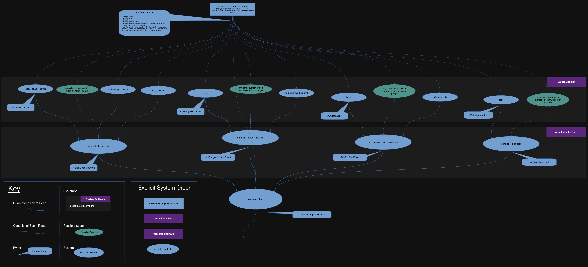

#  System Overview 
In order for the attack system to accommodate the many modifiers mentioned in
the previous chapter, the attack system was designed to run the subsystems which
track each modifier in parallel. This implementation uses bevy's `Event`s to
organize the inputs and outputs of the subsystems while allowing the subsystems
to run at the same time. This design also allows for many subsystems to be added
while limiting the impact on performance, as well as for new modifier subsystems
to be added without needing to change any of the current systems or subsystems.

The mind map below provides an overview of the attack system:

There are several characteristics of the organization of the attack systems
which will be explored in this chapter:
1. How the attack systems start 
2. How data flows through the attack systems 
3. How `Events` are utilized to provide parallel execution
4. How the attack system uses explicit system ordering

## How the Attack Systems Start
When an attack is made, the system starting the attack will start all attack
systems to get the information required for an attack to be completed. 

To make an attack, the system which starts the rest of the attack systems will
send an `Event` called an `AttackDataEvent`, which all the modifying subsystems
are reading with an `EventReader<AttackDataEvent>`. This `AttackDataEvent`
contains the minimum required information to calculate any applicable modifiers.
Any other data about the attacking or defending entity can be derived from the
information sent in the `AttackDataEvent`.

## How data flows through the attack systems 
The system starting the attack will send an `AttackDataEvent` with all the data
required for the attack. This just includes the attacking `Entity`, the
defending `Entity`, some data on the attacker's weapon, and some data on which
iterative attack the attacker is using to make the attack. This event is
then received by all of the modifier systems, which then make their own checks
for whether or not their specific modifier is applicable, and if so what
modifier it will add to the attack. These modifying systems will only send their
events if they have an applicable modifier. However, in order to ensure that at
least one event is sent for the summing system to receive, each modifier has one
base system which will always send forward an event.

For example, let's assume an attack has been made with a valid target. The
starting system will send out an `AttackDataEvent`, which is then received by
the base system, `base_attack_bonus`, and the `add_weapon_focus` system. Every
attacker must have a base attack bonus, which the `base_attack_bonus` system
will query for and send in an `AttackModEvent`. In our example, let us say that
the attacker does not have the *Weapon Focus* feat required for the modifier in
`add_weapon_focus` to apply. In that case, the `add_weapon_focus` system will
not send an `AttackModEvent`, but will just return with an empty value `()`.

The `AttackModEvent` is then received by the `sum_attack_mod_list`, which sums
the modifiers for all of the `AttackModEvent` it receives. The other attack
summing systems, e.g. `sum_crit_range_mod_list`, will similarly sum any
applicable modifiers, if it has received any, on top of the base modifier it is
guaranteed to have received. All of these summed modifiers are then sent out
through their own events, for example the `AttackModSumEvent`, which are read by
`complete_attack`. 

The `complete_attack` system can then use all of the summed modifiers to
evaluate the attack as a whole to see if the attack has hit, if it has crit, and
can calculate damage based on the modifiers it has been provided.

## How Events are utilized to 
