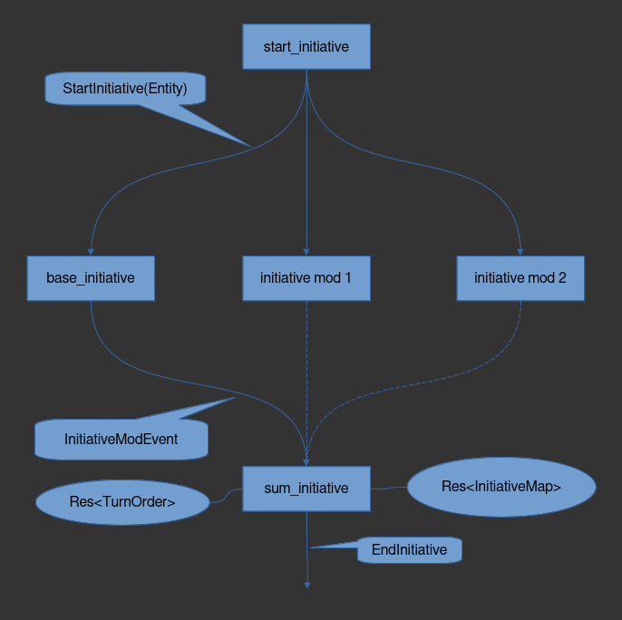

# Initiative System
The initiative system has a similar, but slightly different, structure to the
[ attack system ](./game_systems/combat_system/attack_system/attack.md).
Whereas the modifiers in the attack system are intended to sum the modifiers for
only one entity, the modifiers for initiative are summed for all creatures at
once.

The mind map below gives an overview of the initiative system structure:


The `start_initiative` system will send an event (`StartInitiative`) to all all the modifying
sub-systems. `StartInitiative` is a wrapper for an entity, which the modifying
systems can use to determine whether or not they are applicable. Because one
`StartInitiative` event is sent out at once, the modifying sub-system will run
once for each `Entity`.

A modifying sub-system will read `StartInitiative` and send an
`InitiativeModEvent`. For example, the base initiative sub-system below:
```rust,noplayground
pub fn base_initiative(
    mut event_reader: EventReader<StartInitiative>,
    mut event_writer: EventWriter<InitiativeModEvent>,
    query_dexterity: Query<&Dexterity, With<Creature>>,
) {
    for creature in event_reader.into_iter() {
        if let Ok(dexterity) = query_dexterity.get(**creature) {
            let initiative_event = InitiativeModEvent::from(InitiativeMod {
                bonus: dexterity.bonus(),
                source: InitiativeBonusSource::Dexterity,
                bonus_type: BonusType::Untyped,
                entity: **creature,
            });
            event_writer.send(initiative_event);
      #        } else {
      #            panic!(
      #                "Cannot have a creature without dexterity roll initiative. \
      #            Every Creature must have Dexterity."
      #            )
        }
    }
}
```

Because the subsystem iterates over each `StartInitiative` event, and there will
be more than one such event, the subsystem will send out more than one
`InitiativeModEvent`, each of which will have the `Entity` to which they are to
be applied. The `InitiativeModEvent`s will then be summed together in the 
`sum_initiative_modifiers` system.

```rust,noplayground 
pub fn sum_initiative_modifiers(
    mut event_reader: EventReader<InitiativeModEvent>,
    mut end_initiative: EventWriter<EndInitiative>,
    mut initiative_map: ResMut<InitiativeMap>,
    mut turn_order: ResMut<TurnOrder>,
) {
  # let debug = true;
    for event in event_reader.into_iter() {
        initiative_map
            .entry(event.entity)
            .and_modify(|e| e.push(**event))
            .or_insert(InitiativeDetails::from(**event));
    }

    for (entity, summed_initiative) in initiative_map.iter_mut() {
        summed_initiative.bonus = Initiative::from_isize(summed_initiative.sum_all());
    #     if debug {
    #         debug_sum_initiative_modifers(entity, summed_initiative);
    #     }
    }

    let mut rng = rand::thread_rng();
    *turn_order = TurnOrder::from_vec(initiative_map.generate_turn_order(&mut rng));

    end_initiative.send(EndInitiative);
}
```

As can be seen in `sum_initiative_modifiers` above, each event is gone over
together, and then translated into an `InitiativeMap` resource which is built
from the data in the `InitiativeModEvent`. The `InitiativeMap` provides a way
assign all of the events to the `Entity` to which they are to be applied. This
way, the modifiers applicable to each entity can be summed without concern that
the modifier which is meant for one entity is added to another.

Once the initiative modifiers are all summed, the results are used to generate
the turn order for the coming combat in `InitiativeMap::generate_turn_order`,
which manages the logic for breaking ties. The `TurnOrder` resource can then be
used in the systems which manage turn order.

Finally, an `EndInitiative` event is sent out, which is a simple unit `Event`
signalling that turn order has been established and the initiative systems have
completed successfully.
